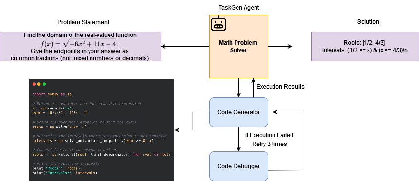

# MATH DATASET

- We provide the selected Level-5 problems on 5 categories (20x5 = 100 problems) in file `selected_problems_level_5.json` that we used in our paper.
- In order to run evaluation, first download and extract the MATH dataset from the main [repo](https://github.com/hendrycks/math). 